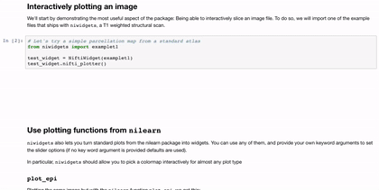

.. niwidgets documentation master file, created by

# Make your neuroimaging plots interactive.

`niwidgets` is a package that provides easy and general wrappers to display interactive widgets that visualise standard-format neuroimaging data, using new functions and standard functions from other libraries.

`niwidgets` was initially developed by [Bjoern Soergel](http://www.ast.cam.ac.uk/~bs538/index.html) and [Jan Freyberg](http://www.janfreyberg.com/).

It's actively being developed by members of the
[brainhack](http://www.brainhack.org/) community, in particular
[Satrajit Ghosh](https://github.com/satra),
[Melanie Ganz](https://github.com/melanieganz),
[Murat Bilgel](https://github.com/bilgelm),
[Ariel Rokem](https://github.com/arokem),
and [@elyb01](https://github.com/elyb01).

We welcome contributions of any kind - feature suggestions, feature additions or bug reports should all be done at http://www.github.com/nipy/niwidgets.

.. toctree::
   :maxdepth: 3
   :caption: Documentation content:

   installation.rst
   examples.ipynb
   api
